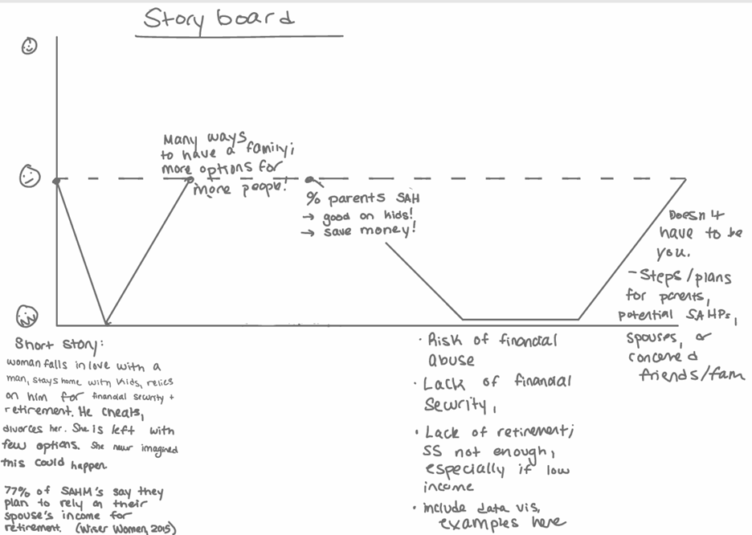
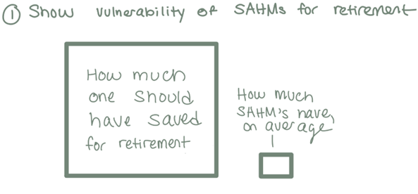
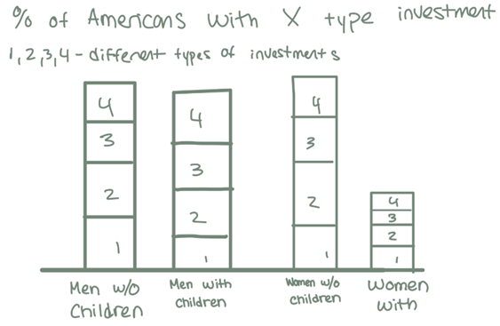
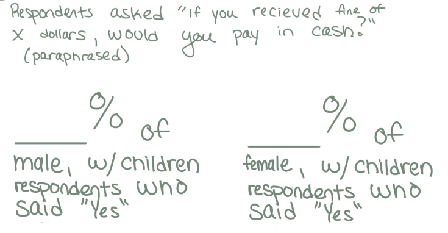

| [home page](https://sophieayn.github.io/sophieayn-datavis-portfolio/) | [data viz examples](dataviz-examples) | [critique by design](critique-by-design) | [final project I](final-project-part-one) | [final project II](final-project-part-two) | [final project III](final-project-part-three) |
# Final Project Part I

# Outline
## Summary

Stay-at-home parents are uniquely vulnerable to financial abuse from their partners. Financial abuse is often intertwined with other forms of abuse. Victims of domestic partner violence and abuse, even when they know the nature of the relationship they are in, may remain with their abuser if they rely on them financially. People who become victims of abuse do not enter abusive relationships knowingly; they may believe that they are the exception to the rule. 

In this project, I want readers to leave knowing they are not the exception, and that anyone can become a victim of financial abuse. More specifically, I want readers who are or plan to become stay-at-home parents to prioritize means to have some form of financial independence, such as having a personal, independent bank account or opening a Spousal Roth IRA. I want readers who are or plan to be the breadwinner with a stay-at-home partner to prioritize their partner’s financial security and independence. I want all readers to leave understanding the risk stay-at-home parents are in and to have knowledge they can pass on to friends and loved ones who are vulnerable. 

## Project Structure

### Story Board

### Structure using Set-Up, Conflict, Resolution:

Setup: 
Stay-at-home parents are often financially dependent on their partners. 
* 26% of mothers were stay-at-home moms, while 7% of fathers were stay-at-home dads (Fry, 2023).

Conflict: 
Financial dependence leaves stay-at-home parents vulnerable to financial abuse and financial insecurity.  

* Financial abuse occurs when one partner intentionally holds power and control over “their partner’s finances or their ability to provide for themselves through a job or public assistance they receive” (National Domestic Violence Hotline).

* “Only 44% of stay-at-home moms are saving for retirement, and 51% do not have any sort strategy for retirement – written or unwritten” (Retirement Planning for Stay-At-Home Moms 2018).

* Sketch: Show savings difference between ideal and stay-at-home mothers. 
   

* Sketch: Compare men, women, parents, non-parents investment diversification and aggregation.
    

* Other forms of domestic abuse can be coupled with financial abuse. This can play a major role in victims of domestic abuse staying in their abusive relationships. If a victim cannot afford to live independently, if their credit score has been ruined, if they are in debt from their partner, if they cannot obtain an income sufficient to support their children, they may feel as though they have no other option than to stay in an abusive relationship. 

* Sketch: Compare survey responses; there are a few financial security based questions in the data below which could be used. 
  

  Potentially, this information could be displayed with a visualization as well.

  

Resolution: There are actions we can all take to support ourselves and our loved ones. 

* For those who are not yet in relationships or in a family planning stage, preparation for financial independence and security can start now. 
* For those in relationships who are planning to have a stay-at-home parent, steps can be taken to ensure both parties are financially independent. 
* Spousal IRA for retirement, independent bank accounts, individual planning for worst-case for childcare and income. 
* For those in abusive relationships currently who may or may not be experiencing financial abuse, there are resources which can help. 

# The data
1. [Federal Reserve Board - Data:](https://www.federalreserve.gov/consumerscommunities/shed_data.htm) 2024 Survey of Household Economics and Decision-making
This link brings you to the Board of Governors of the Federal Reserve System Survey of Household Economics and Decision-making page, which has the survey data and codebooks from 2013 to 2024. This resource is reputable, as it is directly from the U.S. Federal Reserve.
Each file contains answers to survey questions on individual’s retirement savings and investments. Survey participants’ age, gender, race, child status, marital status, education, and employment status are included. This data source will likely be used in the majority of my visualizations, due to the amount of information it has on respondent’s base characteristics and their retirement, saving, spending habits and perceptions. This data can be used to approximate whether a respondent is a stay-at-home parent, which is very important for my project. I will use this data to compare different groups of people, such as people with children, people without, and people who work as stay-at-home parents, following a gender divide. Additionally, as there are 11 years of surveys, I could conglomerate the data to compare the population over a decade. 

2. [BLS Data Viewer](https://data.bls.gov/dataViewer/view/timeseries/LNU01300002) - Labor Force Statistics from the Current Population Survey
This resource is from the U.S. Department of Labor; more specifically, the U.S> Bureau of Labor Statistics (BLS). The BLS Data Viewer is a search engine which can provide access to many different datasets. There are many small datasets which measure one aspect of the population over time. For example: Labor force participations for women/men with/out own children under 6/ under 1/under 18. The same categories and employment-population rate, and unemployment rate are available as well. This could be useful in showing how labor force has shifted over the years, with some shifts being expected as the expectations of women as stay-at-home mothers changed.

3. [Retirement Planning for Stay-At-Home Moms - Wiser Women ](https://wiserwomen.org/resources/retirement-planning-resources/retirement-planning-for-stay-at-home-moms/)
Women’s Institute for a Secure Retirement (WISER) is a nonprofit organization which focuses women’s risk for ill preparedness for retirement and means to better prepare them. This is a biased source, as they have a goal to improve women’ s retirement income, though still useful. Some of the information, however, is from 2015, which is not ideal. This report has some interesting, quick stats which may be useful:
* “A large number of stay-at-home moms (75%) say they plan to rely on their spouse’s income in retirement” (WISER)
* “Only 44% of stay-at-home moms are saving for retirement, and 51% do not have any sort strategy for retirement – written or unwritten.” (WISER)

4. Some additional information, though not necessarily data sources:
[The Current State of Retirement: The Pre-Retiree Expectations and Retiree Realities](https://www.transamericainstitute.org/docs/library/research/retirees/retirees_survey_2015_report.pdf?sfvrsn=5cff5d9b_2)
[Financial Abuse for Financial Advisors](https://bwjp.org/wp-content/uploads/2024/02/FinancialAbuse_2024.pdf)

# Method and medium
I plan to create my data visualizations using Tableau. I plan on completing my final project using Shorthand. I do not envision myself using software alternative to these programs. 

## References
Fry, Richard. 2023. “Dads Make up 18% of Stay-at-Home Parents in the US.”[https://www.pewresearch.org/short-reads/2023/08/03/almost-1-in-5-stay-at-home-parents-in-the-us-are-dads/](https://www.pewresearch.org/short-reads/2023/08/03/almost-1-in-5-stay-at-home-parents-in-the-us-are-dads/).
WISER. Retirement Planning for Stay-At-Home Moms. 2018. [https://wiserwomen.org/resources/retirement-planning-resources/retirement-planning-for-stay-at-home-moms/](https://wiserwomen.org/resources/retirement-planning-resources/retirement-planning-for-stay-at-home-moms/).
What is Financial Abuse? n.d. Retrieved April 6, 2026. [https://www.thehotline.org/resources/financialabuse/](https://www.thehotline.org/resources/financialabuse/).

## AI acknowledgements
I did not use AI for this assignment.  
